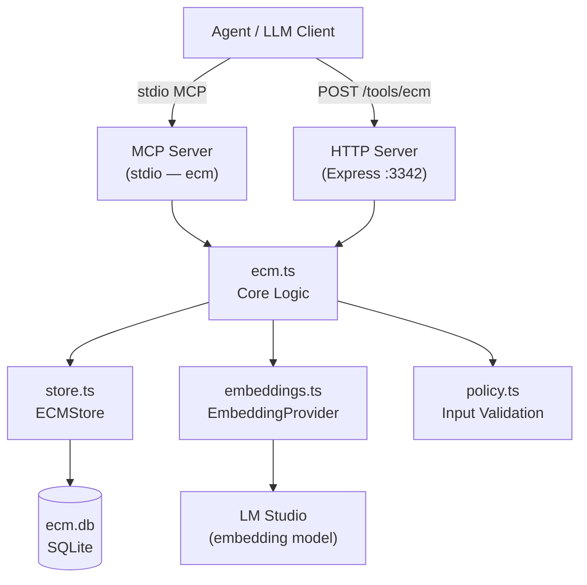
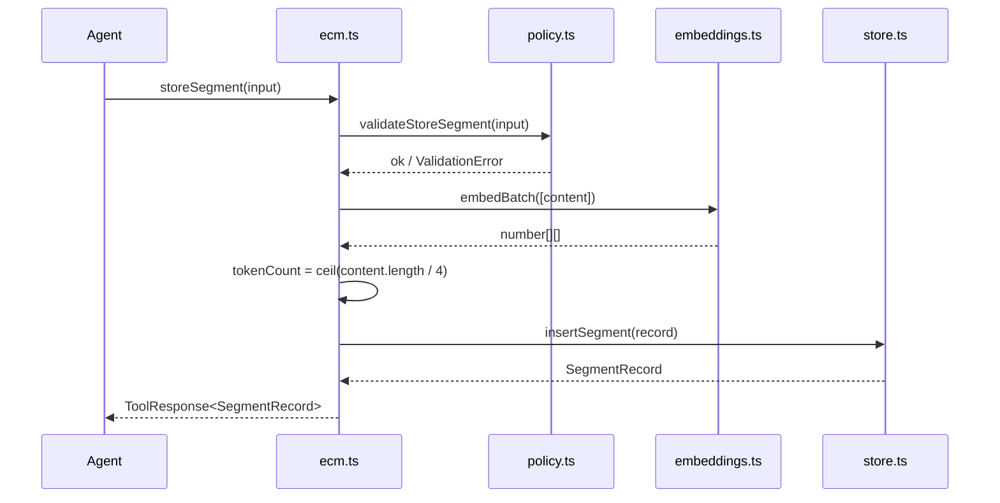
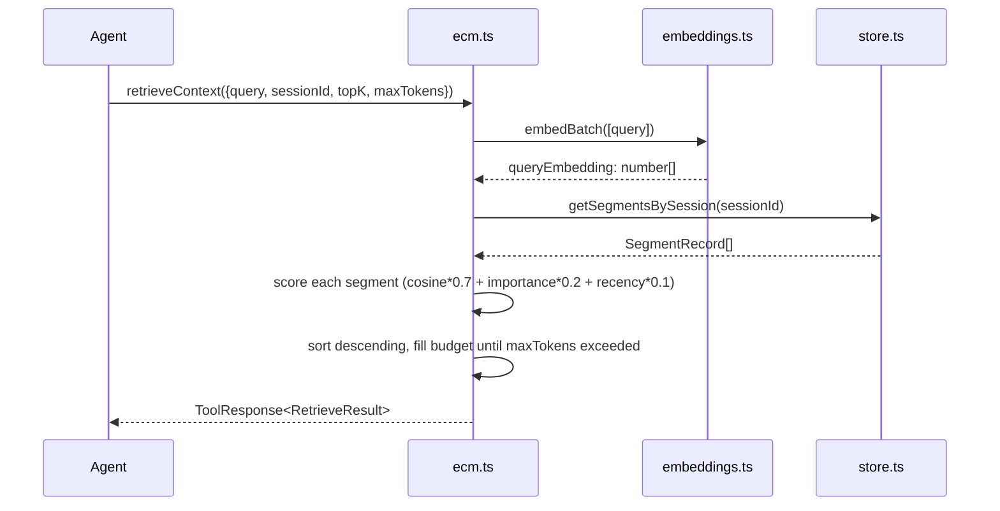
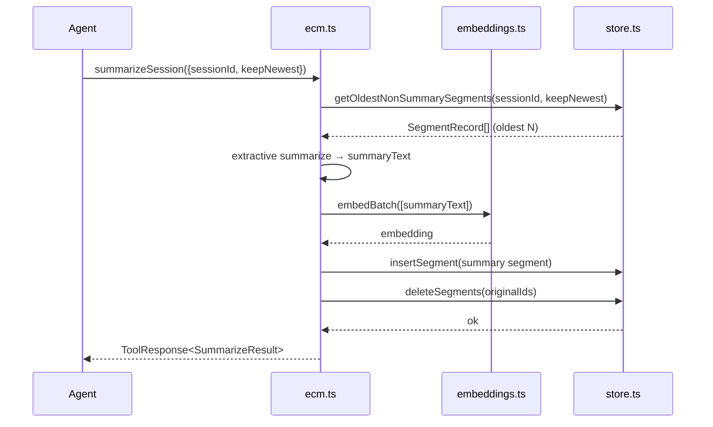

# Design Document: Extended Context Memory Tool (ECM-Tool)

## Overview

The ECM Tool is an external sliding-window context manager that enables an effective 1 million token context window for LLM agents without exceeding hardware limits. It acts as an external memory store that the agent queries before each turn — persisting conversation turns, tool outputs, documents, and reasoning traces as retrievable segments with vector embeddings, then assembling a focused, relevance-ranked context window on demand.

The workspace follows the established monorepo pattern (`ECM/`) with the same file layout as `RAG/` and `AskUser/`. It exposes a single MCP tool (`ecm`) with a flat Zod input shape and an HTTP Express server on port 3342. Storage is SQLite via `better-sqlite3` with embeddings stored as JSON arrays, reusing the same `EmbeddingProvider` infrastructure as RAG.

The "effective context" the agent can reason over becomes unbounded: older segments are compressed via extractive summarization, and each retrieval call returns only the highest-scoring segments that fit within a caller-specified token budget.

## Architecture



## Sequence Diagrams

### store_segment



### retrieve_context



### summarize_session



## Components and Interfaces

### ecm.ts — Core Logic

**Purpose**: Orchestrates all ECM operations; owns scoring, budget enforcement, and extractive summarization.

**Interface**:
```typescript
function storeSegment(input: StoreSegmentInput): Promise<ToolResponse<SegmentRecord>>
function retrieveContext(input: RetrieveContextInput): Promise<ToolResponse<RetrieveResult>>
function listSegments(input: ListSegmentsInput): Promise<ToolResponse<ListSegmentsResult>>
function deleteSegment(input: DeleteSegmentInput): Promise<ToolResponse<DeleteSegmentResult>>
function clearSession(input: ClearSessionInput): Promise<ToolResponse<ClearSessionResult>>
function summarizeSession(input: SummarizeSessionInput): Promise<ToolResponse<SummarizeResult>>
```

**Responsibilities**:
- Delegate input validation to `policy.ts`
- Compute `tokenCount` as `Math.ceil(content.length / 4)`
- Obtain embeddings via `EmbeddingProvider`
- Compute composite retrieval score: `(cosine * 0.7) + (importance * 0.2) + (recency * 0.1)`
- Enforce `maxTokens` budget in `retrieveContext` (greedy fill, highest score first)
- Run extractive summarization in `summarizeSession` (no LLM call)
- Return `ToolResponse<T>` envelopes from `@shared/types`

### store.ts — SQLite Persistence

**Purpose**: All database reads/writes; owns schema init and the `ecm_segments` table.

**Interface**:
```typescript
class ECMStore {
  constructor(dbPath: string)
  insertSegment(record: SegmentInsertInput): SegmentRecord
  getSegmentById(id: string): SegmentRecord | undefined
  getSegmentsBySession(sessionId: string): SegmentRecord[]
  getOldestNonSummarySegments(sessionId: string, keepNewest: number): SegmentRecord[]
  listSegments(sessionId: string, limit: number, offset: number): SegmentRecord[]
  deleteSegment(id: string): { deleted: boolean }
  deleteSegmentsByIds(ids: string[]): { deletedCount: number }
  clearSession(sessionId: string): { deletedCount: number }
  close(): void
}
```

**Responsibilities**:
- Initialize schema on construction (WAL mode, foreign keys on)
- Store `embedding` as `embedding_json TEXT` (JSON-serialized `number[]`)
- Store `metadata` as `metadata_json TEXT`

### embeddings.ts — Embedding Provider

**Purpose**: Thin re-export of the same `EmbeddingProvider` pattern from RAG.

**Interface**:
```typescript
export type { EmbeddingProvider } from "../RAG/src/embeddings"
export { createEmbeddingProvider } from "../RAG/src/embeddings"
```

Or a direct copy of `RAG/src/embeddings.ts` with `ECM_EMBEDDING_MODEL` / `ECM_EMBEDDINGS_MODE` env vars substituted for the RAG equivalents.

### mcp-server.ts — MCP Registration

**Purpose**: Registers the `ecm` MCP tool with a flat Zod input shape; routes to core logic.

**Interface**: Single exported `createECMMcpServer(): McpServer`

**Responsibilities**:
- Flat Zod shape — all fields optional except `action`
- Map action → payload fields → core function call
- Return `CallToolResult` with `isError` flag

### policy.ts — Input Validation

**Purpose**: Pure validation functions; no I/O.

**Interface**:
```typescript
function validateStoreSegment(input: unknown): StoreSegmentInput
function validateRetrieveContext(input: unknown): RetrieveContextInput
function validateListSegments(input: unknown): ListSegmentsInput
function validateDeleteSegment(input: unknown): DeleteSegmentInput
function validateClearSession(input: unknown): ClearSessionInput
function validateSummarizeSession(input: unknown): SummarizeSessionInput
```

### index.ts — HTTP Express Server

**Purpose**: Express server on port 3342; mirrors MCP operations over HTTP.

**Routes**:
- `GET /health`
- `GET /tool-schema`
- `POST /tools/ecm`

## Data Models

### SegmentRecord (DB row + API response)

```typescript
interface SegmentRecord {
  id: string                  // UUID v4
  sessionId: string           // agent session namespace
  type: SegmentType           // 'conversation_turn' | 'tool_output' | 'document' | 'reasoning' | 'summary'
  content: string             // raw text
  embedding_json: string      // JSON-serialized number[]
  tokenCount: number          // Math.ceil(content.length / 4)
  metadata_json: string | null // JSON-serialized Record<string, unknown>
  importance: number          // float 0–1, default 0.5
  createdAt: string           // ISO 8601
}
```

```typescript
type SegmentType = 'conversation_turn' | 'tool_output' | 'document' | 'reasoning' | 'summary'
```

### StoreSegmentInput

```typescript
interface StoreSegmentInput {
  sessionId: string
  type: SegmentType
  content: string
  importance?: number          // default 0.5
  metadata?: Record<string, unknown>
}
```

### RetrieveContextInput

```typescript
interface RetrieveContextInput {
  sessionId: string
  query: string
  topK?: number               // default 10
  maxTokens?: number          // default 4096 — budget cap
  minScore?: number           // optional minimum composite score filter
}
```

### RetrieveResult

```typescript
interface RetrieveResult {
  segments: ScoredSegment[]
  totalTokens: number         // sum of tokenCount for returned segments
  truncated: boolean          // true if budget cut off additional results
}

interface ScoredSegment {
  id: string
  sessionId: string
  type: SegmentType
  content: string
  tokenCount: number
  importance: number
  createdAt: string
  score: number               // composite score
  metadata: Record<string, unknown>
}
```

### ListSegmentsInput / ListSegmentsResult

```typescript
interface ListSegmentsInput {
  sessionId: string
  limit?: number              // default 20
  offset?: number             // default 0
}

interface ListSegmentsResult {
  segments: SegmentRecord[]
  total: number
}
```

### SummarizeSessionInput / SummarizeResult

```typescript
interface SummarizeSessionInput {
  sessionId: string
  keepNewest?: number         // keep this many newest segments untouched (default 10)
}

interface SummarizeResult {
  summarySegmentId: string
  originalSegmentsRemoved: number
  summaryTokenCount: number
}
```

### SQLite Schema

```sql
CREATE TABLE IF NOT EXISTS ecm_segments (
  id              TEXT PRIMARY KEY,
  session_id      TEXT NOT NULL,
  type            TEXT NOT NULL,
  content         TEXT NOT NULL,
  embedding_json  TEXT NOT NULL,
  token_count     INTEGER NOT NULL,
  metadata_json   TEXT,
  importance      REAL NOT NULL DEFAULT 0.5,
  created_at      DATETIME DEFAULT CURRENT_TIMESTAMP
);

CREATE INDEX IF NOT EXISTS idx_ecm_session_id ON ecm_segments(session_id);
CREATE INDEX IF NOT EXISTS idx_ecm_session_type ON ecm_segments(session_id, type);
CREATE INDEX IF NOT EXISTS idx_ecm_created_at ON ecm_segments(created_at);
```

### Environment Variables

| Variable | Default | Description |
|---|---|---|
| `ECM_DB_PATH` | `../ecm.db` (relative to `__dirname`) | SQLite database file path |
| `ECM_EMBEDDINGS_MODE` | `lmstudio` | `lmstudio` or `mock` |
| `ECM_EMBEDDING_MODEL` | `nomic-ai/nomic-embed-text-v1.5` | LM Studio embedding model name |
| `PORT` | `3342` | HTTP server port |

## Key Functions with Formal Specifications

### computeScore(segment, queryEmbedding, now)

```typescript
function computeScore(
  segment: SegmentRecord,
  queryEmbedding: number[],
  now: Date
): number
```

**Preconditions**:
- `segment.embedding_json` is a valid JSON-serialized `number[]` of the same dimension as `queryEmbedding`
- `queryEmbedding` is a non-empty normalized vector
- `segment.importance` is in `[0, 1]`
- `segment.createdAt` is a valid ISO 8601 string representing a past or present time

**Postconditions**:
- Returns a finite number in `[0, 1]` (all three components are bounded)
- `score = (cosineSimilarity * 0.7) + (importance * 0.2) + (recencyScore * 0.1)`
- `recencyScore = 1 / (1 + ageInHours)` where `ageInHours = (now - createdAt) / 3_600_000`
- If embedding dimensions mismatch, `cosineSimilarity` returns `-1` and score may be negative (filtered by caller)

**Loop Invariants**: N/A (no loops; cosine similarity is a single dot-product pass)

### retrieveContext(input)

```typescript
function retrieveContext(input: RetrieveContextInput): Promise<ToolResponse<RetrieveResult>>
```

**Preconditions**:
- `input.sessionId` is a non-empty string
- `input.query` is a non-empty string
- `input.maxTokens` is a positive integer (default 4096)
- `input.topK` is a positive integer (default 10)

**Postconditions**:
- Returns segments sorted by composite score descending
- `result.totalTokens` equals the sum of `tokenCount` for all returned segments
- `result.totalTokens <= input.maxTokens` (budget is never exceeded)
- `result.truncated === true` iff at least one scored segment was excluded due to budget
- No segment with `score < input.minScore` (when provided) is included

**Loop Invariant**: After processing segment `i` in score-sorted order, `accumulatedTokens` equals the sum of `tokenCount` for all segments added so far; all added segments have `score >= minScore`.

### summarizeSession(input)

```typescript
function summarizeSession(input: SummarizeSessionInput): Promise<ToolResponse<SummarizeResult>>
```

**Preconditions**:
- `input.sessionId` is a non-empty string
- `input.keepNewest >= 0` (default 10)
- Session has at least one non-summary segment older than the `keepNewest` boundary

**Postconditions**:
- Exactly one new `'summary'` segment is inserted for the session
- All `N` oldest non-summary segments that were summarized are deleted
- `result.originalSegmentsRemoved === N`
- `result.summaryTokenCount === Math.ceil(summaryText.length / 4)`
- The new summary segment's `importance` is `0.8` (elevated above default to preserve gist)
- If fewer than 2 non-summary segments exist outside the `keepNewest` window, returns early with no changes

### extractiveSummarize(segments)

```typescript
function extractiveSummarize(segments: SegmentRecord[]): string
```

**Preconditions**:
- `segments` is a non-empty array of `SegmentRecord` objects
- Each segment has non-empty `content`

**Postconditions**:
- Returns a non-empty string
- Output is a concatenation of the highest-scoring sentences from the input segments
- No LLM call is made; algorithm is purely extractive (sentence scoring by position + length heuristic)
- Output length is bounded: at most `Math.min(segments.length * 200, 2000)` characters

**Loop Invariant**: After processing sentence `i`, `selected` contains the top-scoring sentences seen so far, ordered by their original position in the source text.

## Algorithmic Pseudocode

### retrieve_context Algorithm

```pascal
ALGORITHM retrieveContext(input)
INPUT: input = { sessionId, query, topK, maxTokens, minScore? }
OUTPUT: ToolResponse<RetrieveResult>

BEGIN
  queryEmbedding ← AWAIT embeddings.embedBatch([input.query])[0]
  segments       ← store.getSegmentsBySession(input.sessionId)
  now            ← currentTime()

  scored ← []
  FOR each seg IN segments DO
    embedding ← JSON.parse(seg.embedding_json)
    cosine    ← cosineSimilarity(queryEmbedding, embedding)
    ageHours  ← (now - parseDate(seg.created_at)) / 3_600_000
    recency   ← 1 / (1 + ageHours)
    score     ← (cosine * 0.7) + (seg.importance * 0.2) + (recency * 0.1)

    IF input.minScore IS DEFINED AND score < input.minScore THEN
      CONTINUE
    END IF

    scored.append({ ...seg, score })
  END FOR

  scored.sortDescending(by: score)
  scored ← scored.slice(0, input.topK)

  // Budget enforcement
  result    ← []
  totalToks ← 0
  truncated ← false

  FOR each seg IN scored DO
    IF totalToks + seg.tokenCount > input.maxTokens THEN
      truncated ← true
      CONTINUE
    END IF
    result.append(seg)
    totalToks ← totalToks + seg.tokenCount
  END FOR

  RETURN successResponse({ segments: result, totalTokens: totalToks, truncated })
END
```

**Loop Invariant (budget loop)**: After processing segment `i`, `totalToks` equals the sum of `tokenCount` for all segments in `result[0..i]`, and `totalToks <= input.maxTokens`.

### summarize_session Algorithm

```pascal
ALGORITHM summarizeSession(input)
INPUT: input = { sessionId, keepNewest }
OUTPUT: ToolResponse<SummarizeResult>

BEGIN
  toSummarize ← store.getOldestNonSummarySegments(input.sessionId, input.keepNewest)

  IF toSummarize.length < 2 THEN
    RETURN errorResponse(INVALID_INPUT, "Not enough segments to summarize")
  END IF

  summaryText ← extractiveSummarize(toSummarize)
  tokenCount  ← ceil(summaryText.length / 4)
  embedding   ← AWAIT embeddings.embedBatch([summaryText])[0]

  summaryRecord ← store.insertSegment({
    sessionId:     input.sessionId,
    type:          'summary',
    content:       summaryText,
    embedding_json: JSON.stringify(embedding),
    tokenCount,
    importance:    0.8,
    metadata_json: JSON.stringify({ summarizedCount: toSummarize.length })
  })

  ids ← toSummarize.map(s => s.id)
  store.deleteSegmentsByIds(ids)

  RETURN successResponse({
    summarySegmentId:        summaryRecord.id,
    originalSegmentsRemoved: ids.length,
    summaryTokenCount:       tokenCount
  })
END
```

### extractiveSummarize Algorithm

```pascal
ALGORITHM extractiveSummarize(segments)
INPUT: segments: SegmentRecord[]
OUTPUT: summaryText: string

BEGIN
  // Collect all sentences from all segments, preserving order
  allSentences ← []
  FOR each seg IN segments DO
    sentences ← splitIntoSentences(seg.content)
    FOR each sent IN sentences DO
      allSentences.append({ text: sent, position: allSentences.length, segImportance: seg.importance })
    END FOR
  END FOR

  // Score each sentence: position bonus (earlier = higher) + length bonus (longer = richer)
  maxLen ← max(allSentences.map(s => s.text.length))
  FOR each sent IN allSentences DO
    posScore    ← 1 / (1 + sent.position * 0.1)
    lenScore    ← min(sent.text.length / maxLen, 1.0)
    sent.score  ← (posScore * 0.4) + (lenScore * 0.3) + (sent.segImportance * 0.3)
  END FOR

  // Select top sentences up to character budget
  budget    ← min(segments.length * 200, 2000)
  sorted    ← allSentences.sortDescending(by: score)
  selected  ← []
  charCount ← 0

  FOR each sent IN sorted DO
    IF charCount + sent.text.length > budget THEN
      BREAK
    END IF
    selected.append(sent)
    charCount ← charCount + sent.text.length
  END FOR

  // Re-order selected sentences by original position for coherence
  selected.sortAscending(by: position)

  RETURN selected.map(s => s.text).join(' ')
END
```

**Loop Invariant**: After processing sentence `i` in the selection loop, `charCount` equals the total character count of all sentences in `selected[0..i]`, and `charCount <= budget`.

## MCP Tool: Flat Zod Input Shape

The `ecm` MCP tool uses a single flat input shape (same pattern as `rag_knowledge` and `skills`):

```typescript
const ecmInputShape = {
  action: z.enum([
    'store_segment',
    'retrieve_context',
    'list_segments',
    'delete_segment',
    'clear_session',
    'summarize_session',
  ]).describe("The operation to perform."),

  // store_segment fields
  sessionId: z.string().optional()
    .describe("(all actions) Session namespace — isolates segments per agent session."),
  type: z.enum(['conversation_turn', 'tool_output', 'document', 'reasoning', 'summary'])
    .optional()
    .describe("(store_segment) Segment type."),
  content: z.string().optional()
    .describe("(store_segment) Text content to store."),
  importance: z.number().min(0).max(1).optional()
    .describe("(store_segment) Importance weight 0–1 (default 0.5)."),
  metadata: z.record(z.unknown()).optional()
    .describe("(store_segment) Arbitrary metadata JSON."),

  // retrieve_context fields
  query: z.string().optional()
    .describe("(retrieve_context) Query text for semantic search."),
  topK: z.number().optional()
    .describe("(retrieve_context) Max segments to consider before budget (default 10)."),
  maxTokens: z.number().optional()
    .describe("(retrieve_context) Token budget for returned segments (default 4096)."),
  minScore: z.number().optional()
    .describe("(retrieve_context) Minimum composite score filter 0–1."),

  // list_segments fields
  limit: z.number().optional()
    .describe("(list_segments) Max results (default 20)."),
  offset: z.number().optional()
    .describe("(list_segments) Pagination offset (default 0)."),

  // delete_segment field
  segmentId: z.string().optional()
    .describe("(delete_segment) UUID of the segment to delete."),

  // summarize_session field
  keepNewest: z.number().optional()
    .describe("(summarize_session) Number of newest segments to keep untouched (default 10)."),
} as const
```

## Example Usage

```typescript
// Store a conversation turn
await ecm({ action: 'store_segment', sessionId: 'sess-abc', type: 'conversation_turn',
  content: 'User asked about the deployment pipeline.', importance: 0.6 })

// Store a tool output with metadata
await ecm({ action: 'store_segment', sessionId: 'sess-abc', type: 'tool_output',
  content: 'kubectl get pods returned: pod-1 Running, pod-2 Pending',
  metadata: { tool: 'kubectl', exitCode: 0 } })

// Retrieve relevant context before next turn
const ctx = await ecm({ action: 'retrieve_context', sessionId: 'sess-abc',
  query: 'deployment pipeline status', topK: 15, maxTokens: 2048 })
// ctx.data.segments → ranked segments fitting within 2048 tokens
// ctx.data.truncated → true if more results existed beyond budget

// List segments for inspection
await ecm({ action: 'list_segments', sessionId: 'sess-abc', limit: 20, offset: 0 })

// Compress old segments when session grows large
await ecm({ action: 'summarize_session', sessionId: 'sess-abc', keepNewest: 10 })
// Oldest N segments replaced by a single 'summary' segment

// Delete a specific segment
await ecm({ action: 'delete_segment', sessionId: 'sess-abc', segmentId: 'uuid-here' })

// Wipe an entire session
await ecm({ action: 'clear_session', sessionId: 'sess-abc' })
```

## Correctness Properties

*A property is a characteristic or behavior that should hold true across all valid executions of a system — essentially, a formal statement about what the system should do. Properties serve as the bridge between human-readable specifications and machine-verifiable correctness guarantees.*

### Property 1: Session Isolation

*For any* two distinct session IDs A and B, retrieving context for session A must never return any segment that was stored under session B.

**Validates: Requirements 13.1, 13.3, 2.10**

### Property 2: Token Budget Never Exceeded

*For any* set of stored segments and any `maxTokens` value, the `totalTokens` field of a `retrieve_context` result must always be less than or equal to `maxTokens`.

**Validates: Requirements 2.2**

### Property 3: Composite Score Bounds

*For any* valid segment with `importance ∈ [0, 1]` and any query embedding, the CompositeScore must be a finite number in the range `[-0.7, 1.0]`.

**Validates: Requirements 7.1, 7.4**

### Property 4: Token Count Consistency

*For any* non-empty content string, the stored `tokenCount` must equal `Math.ceil(content.length / 4)` and must be at least `1`.

**Validates: Requirements 9.1, 9.2**

### Property 5: Summarize Session Destructive-Then-Constructive

*For any* session after `summarize_session` completes successfully, all non-summary segments that were outside the `keepNewest` boundary before the call must no longer exist in the ECMStore, and exactly one new `summary` segment must have been inserted.

**Validates: Requirements 6.1, 6.2, 6.3**

### Property 6: Recency Score Monotonically Decreasing with Age

*For any* two past timestamps where t1 is older than t2, the `recencyScore` for t1 must be strictly less than the `recencyScore` for t2.

**Validates: Requirements 7.2, 7.3**

### Property 7: Retrieve Context Sorted by Score Descending

*For any* `retrieve_context` result with multiple segments, for all index pairs `i < j`, `result.segments[i].score` must be greater than or equal to `result.segments[j].score`.

**Validates: Requirements 2.1**

### Property 8: Store Segment Round-Trip

*For any* valid `store_segment` input, the returned `SegmentRecord` must have `content`, `sessionId`, and `type` equal to the input values, and `tokenCount` equal to `Math.ceil(input.content.length / 4)`.

**Validates: Requirements 1.1, 9.1**

### Property 9: Extractive Summarizer Output Bounded

*For any* non-empty array of segments with non-empty content, the `extractiveSummarize` output must be non-empty and its character length must be at most `Math.min(segments.length * 200, 2000)`.

**Validates: Requirements 8.1, 8.2**

### Property 10: Embedding Failure Prevents Partial Write

*For any* `store_segment` call where the EmbeddingProvider throws an error, the ECMStore must contain no new segment after the call — the operation must be fully atomic with respect to the embedding step.

**Validates: Requirements 1.7**

### Property 11: Clear Session Isolation

*For any* two distinct sessions A and B, calling `clear_session` for session A must leave all segments belonging to session B unchanged in the ECMStore.

**Validates: Requirements 5.3, 13.2**

## Error Handling

### Session Not Found / Empty Session

**Condition**: `retrieve_context`, `list_segments`, `summarize_session`, or `clear_session` called with a `sessionId` that has no segments  
**Response**: `retrieve_context` and `list_segments` return empty arrays (not an error); `summarize_session` returns `INVALID_INPUT` if fewer than 2 non-summary segments exist  
**Recovery**: Agent stores segments before querying

### Segment Not Found

**Condition**: `delete_segment` called with an unknown `segmentId`  
**Response**: `ToolResponse` with `errorCode: NOT_FOUND`, HTTP 404  
**Recovery**: Agent calls `list_segments` to discover valid IDs

### Embedding Failure

**Condition**: LM Studio embedding model unavailable or returns an error  
**Response**: `ToolResponse` with `errorCode: EXECUTION_FAILED`; no partial write occurs  
**Recovery**: Logged to stderr; server remains running; agent retries or falls back to `ECM_EMBEDDINGS_MODE=mock`

### Budget Too Small

**Condition**: `maxTokens` is smaller than the `tokenCount` of the highest-scoring segment  
**Response**: Returns `{ segments: [], totalTokens: 0, truncated: true }` — no error, but empty result  
**Recovery**: Agent increases `maxTokens` or reduces segment content size

### Invalid Importance Value

**Condition**: `store_segment` called with `importance` outside `[0, 1]`  
**Response**: `ToolResponse` with `errorCode: INVALID_INPUT`  
**Recovery**: Agent clamps value to `[0, 1]` before retrying

### SQLite Error

**Condition**: Unexpected DB failure (disk full, corruption, locked file)  
**Response**: `ToolResponse` with `errorCode: EXECUTION_FAILED`  
**Recovery**: Logged to stderr; server remains running; `summarize_session` uses a transaction so partial state is never written

## Testing Strategy

### Unit Testing Approach

Test files in `ECM/tests/`:
- `ecm.test.ts` — core logic: store/retrieve/list/delete/clear/summarize, score formula, budget enforcement, session isolation
- `store.test.ts` — SQLite CRUD, `getOldestNonSummarySegments` ordering, `deleteSegmentsByIds` atomicity
- `policy.test.ts` — validation: required fields, importance range, segment type enum, non-empty strings
- `http.test.ts` — Express routes with supertest: all 6 actions, error status codes

Use `:memory:` SQLite path and `ECM_EMBEDDINGS_MODE=mock` for all tests.

### Property-Based Testing Approach

**Property Test Library**: `fast-check`

Key properties:
- `computeScore` — for any valid segment and query embedding, score is a finite number; recency component is strictly decreasing with age
- `retrieveContext` — for any set of segments and any `maxTokens`, `result.totalTokens <= maxTokens` always holds
- `extractiveSummarize` — output length is always `<= min(segments.length * 200, 2000)` characters; output is non-empty when input is non-empty
- Token count — `Math.ceil(content.length / 4) >= 1` for any non-empty string; consistent with stored `tokenCount`
- Session isolation — storing segments under session A never affects retrieval results for session B

### Integration Testing Approach

- MCP server integration: spin up `createECMMcpServer()`, send tool calls via in-process transport, assert `CallToolResult` shape
- Round-trip: `store_segment` → `retrieve_context` with matching query → assert stored segment appears in results
- Budget enforcement: store 10 segments of known token counts → retrieve with tight `maxTokens` → assert `truncated: true` and correct subset returned
- Summarize round-trip: store 15 segments → `summarize_session({ keepNewest: 5 })` → assert 10 originals deleted, 1 summary inserted, 5 newest untouched

## Performance Considerations

- SQLite WAL mode handles concurrent reads; writes are serialized (acceptable for agent workloads)
- `getSegmentsBySession` loads all session segments into memory for scoring — acceptable for sessions up to ~10k segments; beyond that, `summarize_session` should be called periodically
- Embedding computation is the dominant latency: `store_segment` requires one `embedBatch` call; `retrieve_context` requires one `embedBatch` call for the query, then in-process cosine scoring
- Cosine similarity is O(d) per segment where d = embedding dimension (~768 for nomic-embed); scoring 1000 segments takes < 5ms in JS
- `summarize_session` is the only operation that performs a transaction with multiple deletes + one insert — runs atomically, no partial state

## Security Considerations

- No approval gating: ECM operations are low-risk (no external I/O, no code execution)
- `sessionId` is caller-supplied; agents should use unpredictable session IDs (e.g. UUID v4) to prevent cross-session data leakage in multi-tenant deployments
- `metadata` is stored as opaque JSON and never executed; no eval or shell execution occurs
- SQLite file path is configured via `ECM_DB_PATH` env var; default resolves relative to `__dirname` (not CWD) to avoid path traversal surprises
- Embedding model name is configured via env var; not user-controllable at request time

## Dependencies

Follows the same dependency set as `RAG/` and `Skills/`:

```json
{
  "dependencies": {
    "@lmstudio/sdk": "^1.x",
    "@modelcontextprotocol/sdk": "^1.26.0",
    "@shared/types": "file:../shared",
    "better-sqlite3": "^12.6.2",
    "cors": "^2.8.5",
    "dotenv": "^16.6.1",
    "express": "^4.21.2",
    "uuid": "^9.0.1",
    "zod": "^3.25.76"
  },
  "devDependencies": {
    "@types/better-sqlite3": "^7.6.8",
    "@types/cors": "^2.8.19",
    "@types/express": "^4.17.23",
    "@types/node": "^22.13.1",
    "@types/uuid": "^9.0.7",
    "fast-check": "^3.x",
    "jest": "^29.x",
    "supertest": "^6.x",
    "tsx": "^4.19.3",
    "typescript": "^5.8.2"
  }
}
```

### Workspace Structure

```
ECM/
├── src/
│   ├── types.ts          — TypeScript types (SegmentRecord, inputs, results)
│   ├── embeddings.ts     — EmbeddingProvider wrapper (same pattern as RAG)
│   ├── store.ts          — ECMStore (SQLite via better-sqlite3)
│   ├── ecm.ts            — Core logic (scoring, budget, summarization)
│   ├── policy.ts         — Input validation (pure, no I/O)
│   ├── mcp-server.ts     — MCP tool registration (flat Zod shape)
│   └── index.ts          — Express HTTP server (:3342)
├── tests/
│   ├── ecm.test.ts
│   ├── store.test.ts
│   ├── policy.test.ts
│   └── http.test.ts
├── package.json
└── tsconfig.json
```
