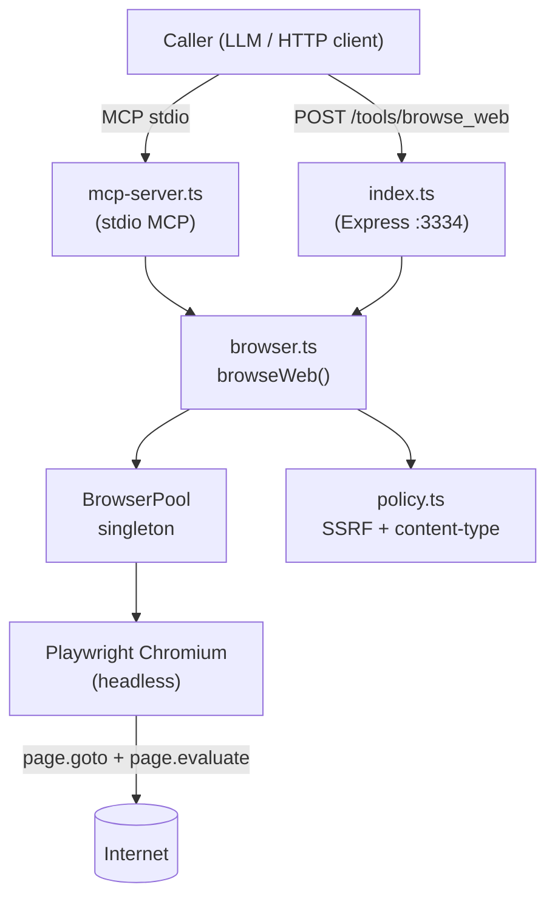
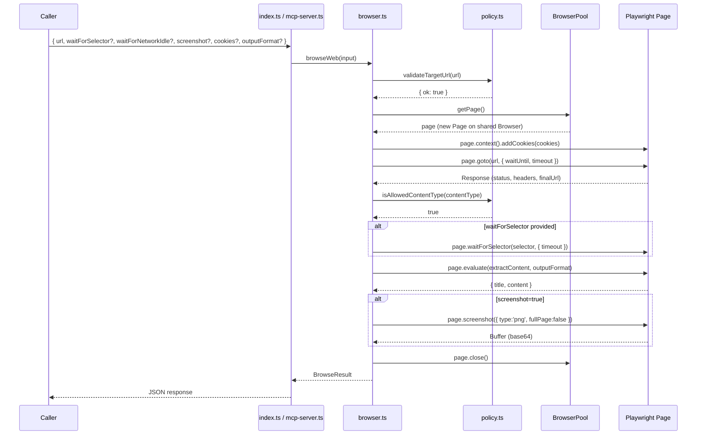
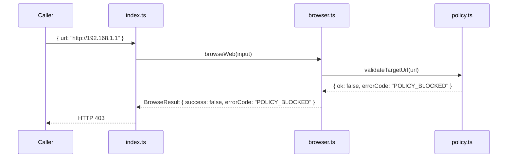

# Design Document: Headless Web Browser Upgrade (v2.1.0)

## Overview

Upgrade the `WebBrowser` tool from a Node.js `fetch` + regex HTML parser to a full headless
Chromium browser powered by Playwright. The upgrade enables JavaScript-rendered pages, SPAs,
and dynamic content while preserving full backward compatibility with existing callers that
only pass `{ url }`. The MCP tool name (`browse_web`), HTTP port (3334), and response envelope
shape are unchanged.

The core change is confined to `WebBrowser/src/browser.ts`: replace the manual redirect-loop
fetch with `playwright.chromium.launch()` → `browser.newPage()` → `page.goto()` →
`page.evaluate()` for DOM-based content extraction, then close the page. A single browser
instance is reused across requests (pooling); only pages are created and destroyed per request.

---

## Architecture



### Key Architectural Decisions

- `BrowserPool` is a module-level singleton initialized lazily on first request and shut down
  via `process.on('exit')` / `SIGTERM` / `SIGINT` handlers.
- Each request gets a fresh `Page`; the page is always closed in a `finally` block.
- SSRF validation still runs before Playwright touches the URL (policy.ts unchanged).
- Content-type check moves to post-navigation: inspect `response.headers()['content-type']`
  from Playwright's `Response` object instead of the fetch `Headers` API.

---

## Sequence Diagrams

### Happy Path — JavaScript-Rendered Page



### Error Path — SSRF Block



---

## Components and Interfaces

### Component: `BrowserPool` (`browser.ts`)

**Purpose**: Manages a single long-lived Playwright `Browser` instance; vends fresh `Page`
objects per request.

**Interface**:
```typescript
interface BrowserPool {
  /** Returns a new Page on the shared Browser, launching it if needed. */
  getPage(): Promise<Page>
  /** Gracefully closes the shared Browser. */
  shutdown(): Promise<void>
}
```

**Responsibilities**:
- Lazy-launch Chromium with `BROWSER_HEADLESS` / `BROWSER_EXECUTABLE_PATH` env vars.
- Serialize concurrent launch attempts (mutex via a pending-promise flag).
- Register `process.on('exit'|'SIGTERM'|'SIGINT')` shutdown hooks once.

---

### Component: `browseWeb` (`browser.ts`)

**Purpose**: Orchestrates a single page visit and returns structured content.

**Interface**:
```typescript
interface BrowseInput {
  url: string
  timeoutMs: number
  maxContentChars: number
  // v2.1.0 additions (all optional)
  waitForSelector?: string
  waitForNetworkIdle?: boolean
  screenshot?: boolean
  cookies?: Array<{ name: string; value: string; domain: string }>
  outputFormat?: 'text' | 'markdown'
}

interface BrowseResult {
  success: boolean
  status: number
  finalUrl: string
  title: string
  content: string
  contentLength: number
  screenshotBase64?: string   // present only when screenshot=true
  error?: string
  errorCode?: string
}
```

**Responsibilities**:
- Validate URL via `policy.validateTargetUrl` before touching Playwright.
- Inject cookies before navigation.
- Choose `waitUntil` strategy: `'networkidle'` when `waitForNetworkIdle=true`, else
  `'domcontentloaded'`.
- Validate response content-type via `policy.isAllowedContentType`.
- Delegate DOM extraction to `extractContent()` (runs inside the page via `page.evaluate`).
- Truncate content to `maxContentChars`.
- Always close the page in `finally`.

---

### Component: `extractContent` (in-page function, `browser.ts`)

**Purpose**: Runs inside Playwright's browser context via `page.evaluate()` to extract
structured content from the live DOM.

**Interface**:
```typescript
// Serialized into the browser context — must be self-contained
function extractContent(outputFormat: 'text' | 'markdown'): { title: string; content: string }
```

**Responsibilities**:
- Remove `<script>`, `<style>`, `<noscript>`, `<svg>` subtrees before traversal.
- Walk the DOM tree and emit text nodes, preserving semantic structure.
- For `'markdown'` format: map `h1–h6` → `# … ######`, `<a>` → `[text](href)`,
  `<li>` → `- item`, `<strong>`/`<b>` → `**text**`, `<em>`/`<i>` → `_text_`.
- For `'text'` format: emit plain whitespace-separated text (existing behavior).
- Use `document.title` for the title field.
- HTML entities are decoded natively by the browser DOM — no manual regex needed.

---

### Component: `policy.ts` (modified)

**Purpose**: SSRF protection and content-type allowlist. Minimal change: add
`application/json` to `ALLOWED_CONTENT_TYPES`.

**Change**:
```typescript
export const ALLOWED_CONTENT_TYPES = [
  "text/html",
  "text/plain",
  "application/xhtml+xml",
  "application/xml",
  "application/json",   // ← added in v2.1.0
];
```

---

### Component: `mcp-server.ts` (modified)

**Purpose**: Expose `browse_web` MCP tool. Add new optional parameters to the Zod schema.

**New schema additions**:
```typescript
waitForSelector: z.string().optional()
  .describe("CSS selector to wait for before extracting content."),
waitForNetworkIdle: z.boolean().optional()
  .describe("Wait for network to be idle before extracting content."),
screenshot: z.boolean().optional()
  .describe("Capture a screenshot and return it as base64."),
cookies: z.array(z.object({
  name: z.string(), value: z.string(), domain: z.string()
})).optional().describe("Cookies to inject before navigation."),
outputFormat: z.enum(['text', 'markdown']).optional()
  .describe("Output format: 'text' (default) or 'markdown'."),
```

---

### Component: `index.ts` (modified)

**Purpose**: HTTP Express server. Add new optional fields to `BrowseRequest` type and pass
them through to `browseWeb`. No structural changes to routing or response envelope.

---

## Data Models

### `BrowseInput` (full v2.1.0)

| Field | Type | Required | Default | Description |
|---|---|---|---|---|
| `url` | `string` | ✓ | — | Target URL (http/https only) |
| `timeoutMs` | `number` | ✓ | 20000 | Navigation + wait timeout |
| `maxContentChars` | `number` | ✓ | 12000 | Content truncation limit |
| `waitForSelector` | `string` | — | — | CSS selector to await |
| `waitForNetworkIdle` | `boolean` | — | `false` | Use `networkidle` wait strategy |
| `screenshot` | `boolean` | — | `false` | Capture PNG screenshot |
| `cookies` | `CookieDef[]` | — | `[]` | Cookies to inject |
| `outputFormat` | `'text'\|'markdown'` | — | `'text'` | Content extraction format |

### `CookieDef`

```typescript
interface CookieDef {
  name: string    // Cookie name
  value: string   // Cookie value
  domain: string  // Domain (e.g. ".example.com")
}
```

### `BrowseResult` (v2.1.0)

| Field | Type | Always present | Description |
|---|---|---|---|
| `success` | `boolean` | ✓ | Operation outcome |
| `status` | `number` | ✓ | HTTP status code (0 on network error) |
| `finalUrl` | `string` | ✓ | Post-redirect actual URL |
| `title` | `string` | ✓ | Page `<title>` |
| `content` | `string` | ✓ | Extracted text or markdown |
| `contentLength` | `number` | ✓ | `content.length` after truncation |
| `screenshotBase64` | `string` | only when `screenshot=true` | PNG as base64 |
| `error` | `string` | on failure | Human-readable error |
| `errorCode` | `string` | on failure | Machine-readable error code |

### Environment Variables

| Variable | Default | Description |
|---|---|---|
| `BROWSER_HEADLESS` | `"true"` | Run Chromium headless (`"false"` for headed) |
| `BROWSER_EXECUTABLE_PATH` | — | Override Chromium binary path |
| `BROWSER_DEFAULT_TIMEOUT_MS` | `"20000"` | Default navigation timeout |
| `BROWSER_MAX_TIMEOUT_MS` | `"60000"` | Maximum allowed timeout |
| `BROWSER_MAX_CONTENT_CHARS` | `"12000"` | Maximum content characters |

---

## Key Functions with Formal Specifications

### `browseWeb(input: BrowseInput): Promise<BrowseResult>`

**Preconditions:**
- `input.url` is a non-empty string
- `input.timeoutMs` is a positive finite number
- `input.maxContentChars` is a positive finite number ≥ 200
- If `input.cookies` is provided, each element has non-empty `name`, `value`, `domain`

**Postconditions:**
- Returns a `BrowseResult` in all code paths (never throws)
- If `validateTargetUrl(input.url).ok === false` → `result.success === false` and
  `result.errorCode` matches the policy error code; Playwright is never invoked
- If navigation succeeds and content-type is allowed → `result.success === true`,
  `result.finalUrl` is the post-redirect URL, `result.content.length ≤ input.maxContentChars`
- If `input.screenshot === true` and navigation succeeded → `result.screenshotBase64` is a
  non-empty base64 string
- The page is always closed regardless of success or failure

**Loop Invariants:** N/A (no explicit loops; Playwright handles redirect following internally)

---

### `BrowserPool.getPage(): Promise<Page>`

**Preconditions:** Pool has not been shut down

**Postconditions:**
- Returns a `Page` attached to a live `Browser` instance
- If the browser was not yet launched, it is launched exactly once (concurrent calls
  serialize — only one `chromium.launch()` call is made)
- `browser.isConnected() === true` after return

---

### `extractContent(outputFormat): { title, content }`

**Preconditions:** Runs inside a Playwright browser context with a fully loaded DOM

**Postconditions:**
- `title` equals `document.title`
- `content` contains no `<script>`, `<style>`, `<noscript>`, or `<svg>` text
- All HTML entities are decoded (handled natively by the DOM)
- If `outputFormat === 'markdown'`: headings are prefixed with `#` characters matching
  their level; links are formatted as `[text](href)`; list items are prefixed with `- `
- If `outputFormat === 'text'`: content is whitespace-normalized plain text

---

## Algorithmic Pseudocode

### Main `browseWeb` Algorithm

```pascal
PROCEDURE browseWeb(input)
  INPUT: input of type BrowseInput
  OUTPUT: result of type BrowseResult

  BEGIN
    // Phase 1: Policy check (no Playwright involved)
    validation ← validateTargetUrl(input.url)
    IF validation.ok = false THEN
      RETURN BrowseResult {
        success: false,
        status: 0,
        finalUrl: input.url,
        errorCode: validation.errorCode,
        error: validation.message
      }
    END IF

    // Phase 2: Acquire page from pool
    page ← AWAIT BrowserPool.getPage()

    TRY
      // Phase 3: Inject cookies
      IF input.cookies IS NOT EMPTY THEN
        AWAIT page.context().addCookies(input.cookies)
      END IF

      // Phase 4: Navigate
      waitUntil ← IF input.waitForNetworkIdle THEN 'networkidle' ELSE 'domcontentloaded'
      response ← AWAIT page.goto(input.url, { waitUntil, timeout: input.timeoutMs })

      IF response IS NULL THEN
        RETURN error("No response received", "EXECUTION_FAILED")
      END IF

      // Phase 5: Content-type guard
      contentType ← response.headers()['content-type']
      IF NOT isAllowedContentType(contentType) THEN
        RETURN error("Unsupported content type: " + contentType, "POLICY_BLOCKED")
      END IF

      // Phase 6: Optional selector wait
      IF input.waitForSelector IS NOT EMPTY THEN
        AWAIT page.waitForSelector(input.waitForSelector, { timeout: input.timeoutMs })
      END IF

      // Phase 7: Extract content from DOM
      { title, content } ← AWAIT page.evaluate(extractContent, input.outputFormat ?? 'text')
      truncated ← content.slice(0, input.maxContentChars)

      // Phase 8: Optional screenshot
      screenshotBase64 ← undefined
      IF input.screenshot = true THEN
        buffer ← AWAIT page.screenshot({ type: 'png', fullPage: false })
        screenshotBase64 ← buffer.toString('base64')
      END IF

      RETURN BrowseResult {
        success: response.status() < 400,
        status: response.status(),
        finalUrl: page.url(),
        title,
        content: truncated,
        contentLength: truncated.length,
        screenshotBase64
      }

    CATCH error
      RETURN BrowseResult {
        success: false, status: 0, finalUrl: input.url,
        error: error.message, errorCode: "EXECUTION_FAILED"
      }

    FINALLY
      AWAIT page.close()   // always runs
    END TRY
  END
END PROCEDURE
```

### `BrowserPool.getPage` Algorithm

```pascal
PROCEDURE BrowserPool.getPage()
  OUTPUT: page of type Page

  BEGIN
    // Serialize concurrent launch attempts
    IF browser IS NULL AND pendingLaunch IS NULL THEN
      headless ← env.BROWSER_HEADLESS ≠ 'false'
      executablePath ← env.BROWSER_EXECUTABLE_PATH  // may be undefined
      pendingLaunch ← chromium.launch({ headless, executablePath })
      browser ← AWAIT pendingLaunch
      pendingLaunch ← NULL
      REGISTER shutdown hooks (once)
    ELSE IF pendingLaunch IS NOT NULL THEN
      AWAIT pendingLaunch   // wait for in-flight launch
    END IF

    page ← AWAIT browser.newPage()
    RETURN page
  END
END PROCEDURE
```

### `extractContent` In-Page Algorithm

```pascal
PROCEDURE extractContent(outputFormat)
  INPUT: outputFormat ∈ { 'text', 'markdown' }
  OUTPUT: { title: String, content: String }

  BEGIN
    title ← document.title

    // Remove noise subtrees
    FOR each tag IN ['script', 'style', 'noscript', 'svg'] DO
      FOR each el IN document.querySelectorAll(tag) DO
        el.remove()
      END FOR
    END FOR

    lines ← []

    PROCEDURE walk(node)
      IF node.nodeType = TEXT_NODE THEN
        text ← node.textContent.trim()
        IF text ≠ '' THEN lines.push(text) END IF
        RETURN
      END IF

      IF outputFormat = 'markdown' THEN
        tag ← node.tagName.toLowerCase()
        CASE tag OF
          'h1'..'h6':
            level ← parseInt(tag[1])
            prefix ← '#'.repeat(level) + ' '
            lines.push(prefix + node.textContent.trim())
            RETURN   // don't recurse — heading text already captured
          'a':
            href ← node.getAttribute('href') ?? ''
            text ← node.textContent.trim()
            IF href ≠ '' THEN
              lines.push('[' + text + '](' + href + ')')
            ELSE
              lines.push(text)
            END IF
            RETURN
          'li':
            lines.push('- ' + node.textContent.trim())
            RETURN
          'strong', 'b':
            lines.push('**' + node.textContent.trim() + '**')
            RETURN
          'em', 'i':
            lines.push('_' + node.textContent.trim() + '_')
            RETURN
        END CASE
      END IF

      FOR each child IN node.childNodes DO
        walk(child)
      END FOR
    END PROCEDURE

    walk(document.body)

    content ← lines.join('\n').replace(/\n{3,}/g, '\n\n').trim()
    RETURN { title, content }
  END
END PROCEDURE
```

---

## Example Usage

```typescript
// Backward-compatible call (existing callers unchanged)
const result = await browseWeb({ url: "https://example.com", timeoutMs: 20000, maxContentChars: 12000 })
// result.content → plain text, result.outputFormat not present

// SPA with network idle wait
const spa = await browseWeb({
  url: "https://app.example.com/dashboard",
  timeoutMs: 30000,
  maxContentChars: 12000,
  waitForNetworkIdle: true,
  waitForSelector: "#main-content",
  outputFormat: "markdown",
})

// Authenticated page with cookies + screenshot
const auth = await browseWeb({
  url: "https://example.com/profile",
  timeoutMs: 20000,
  maxContentChars: 12000,
  cookies: [{ name: "session", value: "abc123", domain: ".example.com" }],
  screenshot: true,
  outputFormat: "markdown",
})
// auth.screenshotBase64 → PNG as base64 string

// JSON API endpoint
const api = await browseWeb({ url: "https://api.example.com/data.json", timeoutMs: 10000, maxContentChars: 12000 })
// Allowed because application/json is now in ALLOWED_CONTENT_TYPES
```

---

## Correctness Properties

*A property is a characteristic or behavior that should hold true across all valid executions of a system — essentially, a formal statement about what the system should do. Properties serve as the bridge between human-readable specifications and machine-verifiable correctness guarantees.*

### Property 1: SSRF policy always fires before Playwright

*For any* input where `validateTargetUrl(input.url).ok === false`, `browseWeb(input)` resolves
without invoking `BrowserPool.getPage()` and returns `result.success === false`.

**Validates: Requirements 3.1, 3.2**

---

### Property 2: Page is always closed

*For any* input (valid or invalid, success or failure), after `browseWeb(input)` resolves,
the `Page` object acquired from `BrowserPool.getPage()` is closed.

**Validates: Requirements 1.6**

---

### Property 3: Content truncation invariant

*For any* successful navigation result, `result.content.length <= input.maxContentChars`
AND `result.contentLength === result.content.length`.

**Validates: Requirements 6.1, 6.2**

---

### Property 4: finalUrl reflects post-redirect URL

*For any* successful navigation, `result.finalUrl` equals `page.url()` at the time of content
extraction, which may differ from `input.url` when HTTP redirects occurred.

**Validates: Requirements 11.1, 11.2**

---

### Property 5: Browser singleton across concurrent requests

*For any* number of concurrent calls to `BrowserPool.getPage()`, `chromium.launch()` is called
at most once per process lifetime, and all calls receive a `Page` on the same `Browser` instance.

**Validates: Requirements 1.5, 2.1, 2.2**

---

### Property 6: HTML entity decoding

*For any* page containing HTML entities (`&amp;`, `&lt;`, `&gt;`, `&nbsp;`, `&#x27;`, `&quot;`,
etc.), `result.content` contains the decoded characters and not the raw entity strings.

**Validates: Requirements 5.9**

---

### Property 7: Markdown heading hierarchy

*For any* input where `outputFormat === 'markdown'` and the page contains `<h1>`–`<h6>` elements,
`result.content` contains lines matching `/^#{1,6} .+/` where the number of `#` characters
matches the heading level of the source element.

**Validates: Requirements 5.4**

---

### Property 8: Markdown inline formatting

*For any* input where `outputFormat === 'markdown'`, the extracted content formats `<a>` elements
as `[text](href)`, `<li>` elements as `- item`, `<strong>`/`<b>` as `**text**`, and
`<em>`/`<i>` as `_text_`.

**Validates: Requirements 5.5, 5.6, 5.7, 5.8**

---

### Property 9: Noise element exclusion

*For any* page containing `<script>`, `<style>`, `<noscript>`, or `<svg>` elements, the text
content of those subtrees does not appear in `result.content`.

**Validates: Requirements 5.1**

---

### Property 10: Disallowed content-type blocks extraction

*For any* navigation response whose `content-type` is not in the allowed list, `browseWeb`
returns `{ success: false, errorCode: "POLICY_BLOCKED" }` without calling `page.evaluate()`.

**Validates: Requirements 4.1, 4.2**

---

### Property 11: browseWeb never throws

*For any* input (including malformed URLs, network errors, timeouts, and unexpected exceptions),
`browseWeb(input)` resolves to a `BrowseResult` and never rejects the returned promise.

**Validates: Requirements 10.1**

---

### Property 12: BrowseResult shape invariant

*For any* input, the resolved `BrowseResult` always contains `success`, `status`, `finalUrl`,
`title`, `content`, and `contentLength` fields, and `screenshotBase64` is present if and only
if `input.screenshot === true` and navigation succeeded.

**Validates: Requirements 9.1, 9.2, 10.5, 12.3, 12.4**

---

### Property 13: Cookie isolation between requests

*For any* two sequential `browseWeb` calls where the first injects cookies, the cookies from
the first request do not appear in the page context of the second request.

**Validates: Requirements 8.3**

---

### Property 14: SSRF blocked hostname coverage

*For any* hostname in the RFC-1918 private ranges (10.x.x.x, 172.16–31.x.x, 192.168.x.x),
loopback addresses (localhost, 127.0.0.1, ::1), or link-local range (169.254.x.x),
`isBlockedHostname(hostname)` returns `true`.

**Validates: Requirements 3.3**

---

## Error Handling

### Scenario 1: Navigation Timeout

**Condition**: `page.goto()` or `page.waitForSelector()` exceeds `timeoutMs`  
**Response**: Playwright throws `TimeoutError`; caught in the `catch` block  
**Result**: `{ success: false, errorCode: "TIMEOUT", error: "Navigation timeout after Nms" }`  
**Recovery**: Page is closed in `finally`; pool browser remains alive

### Scenario 2: Browser Crash / Disconnection

**Condition**: Playwright `Browser` disconnects unexpectedly  
**Response**: `getPage()` detects `!browser.isConnected()`, nulls the instance, re-launches  
**Result**: Next request gets a fresh browser; current request returns `EXECUTION_FAILED`

### Scenario 3: Blocked Content-Type

**Condition**: Response `content-type` is not in `ALLOWED_CONTENT_TYPES` (e.g. `image/png`)  
**Response**: Early return before `page.evaluate()`  
**Result**: `{ success: false, errorCode: "POLICY_BLOCKED", status: <HTTP status> }`

### Scenario 4: waitForSelector Not Found

**Condition**: Selector not present within `timeoutMs`  
**Response**: Playwright throws `TimeoutError`  
**Result**: `{ success: false, errorCode: "TIMEOUT", error: "Selector '...' not found" }`

### Scenario 5: Screenshot Failure

**Condition**: `page.screenshot()` fails (e.g. page already closed)  
**Response**: Caught separately; navigation result is still returned  
**Result**: `screenshotBase64` is omitted; `success` reflects navigation outcome

---

## Testing Strategy

### Unit Testing Approach

Test `policy.ts` in isolation (no Playwright dependency):
- `isAllowedContentType` now accepts `application/json`
- `validateTargetUrl` unchanged behavior
- `isBlockedHostname` unchanged behavior

Test `extractContent` logic by injecting mock DOM structures (jsdom or happy-dom in Jest).

### Property-Based Testing Approach

**Property Test Library**: `fast-check`

Key properties to test with generated inputs:
- `content.length <= maxContentChars` for any valid page content
- `extractContent` with `outputFormat='markdown'` always produces headings matching `/^#{1,6} /`
  for any h1–h6 element
- `browseWeb` with a blocked URL always returns `success: false` without calling `getPage()`
- HTML entity strings (`&amp;`, `&lt;`, `&gt;`, `&nbsp;`, `&#x27;`, `&quot;`) never appear
  in extracted content

### Integration Testing Approach

Use Playwright's built-in test server or `msw` to serve controlled HTML fixtures:
- Static HTML page → verify text extraction
- SPA fixture with `setTimeout` DOM mutation → verify `waitForNetworkIdle` captures content
- Redirect chain → verify `finalUrl` is the terminal URL
- Page with cookies → verify cookie injection reaches the server
- Backward-compat: call with only `{ url, timeoutMs, maxContentChars }` → shape matches v1.0.0

### Existing Tests

`WebBrowser/tests/http.test.ts` and `policy.test.ts` must continue to pass without
modification (backward compatibility gate).

---

## Performance Considerations

- **Browser reuse**: Launching Chromium takes ~500ms–1s. Reusing a single instance across
  requests eliminates per-request startup cost.
- **Page isolation**: Each request gets a fresh `Page` (separate JS context, cookies, storage).
  Pages are closed immediately after use to free memory.
- **`domcontentloaded` default**: Faster than `load` or `networkidle` for most pages. Callers
  opt into `networkidle` explicitly via `waitForNetworkIdle: true`.
- **Screenshot cost**: PNG capture adds ~50–200ms and significant memory. Only triggered when
  `screenshot: true`.
- **Memory ceiling**: A single idle Chromium process uses ~80–150MB. Under load, each open
  page adds ~20–50MB. The single-browser, single-page-at-a-time model keeps memory bounded.

---

## Security Considerations

- **SSRF**: `validateTargetUrl` runs before any Playwright call. Private/loopback/link-local
  addresses are blocked at the policy layer, not by Playwright.
- **Content-type enforcement**: Prevents Playwright from executing or returning binary blobs.
- **Cookie injection scope**: Cookies are added to the page context only; they do not persist
  across requests (fresh page per request).
- **Headless mode**: `BROWSER_HEADLESS=true` by default. Headed mode (`false`) is only for
  local debugging and must not be used in production.
- **Executable path override**: `BROWSER_EXECUTABLE_PATH` allows using a sandboxed system
  Chromium instead of the bundled one. Validate this path is not user-controlled at runtime.
- **No arbitrary JS execution**: `page.evaluate()` only runs the bundled `extractContent`
  function — callers cannot inject arbitrary scripts.

---

## Dependencies

| Package | Version | Purpose |
|---|---|---|
| `playwright` | `^1.40.0` | Headless Chromium browser automation |
| `@modelcontextprotocol/sdk` | `^1.26.0` | MCP server (unchanged) |
| `express` | `^4.21.2` | HTTP server (unchanged) |
| `zod` | `^3.25.76` | Input validation (unchanged) |
| `dotenv` | `^16.6.1` | Env config (unchanged) |
| `@shared/types` | `file:../shared` | Shared response envelope (unchanged) |

**Note**: `playwright` ships with its own Chromium binary via `npx playwright install chromium`.
Add this as a post-install step or document it in the `README`. The existing `node-fetch` /
native `fetch` dependency is removed entirely from `browser.ts`.
