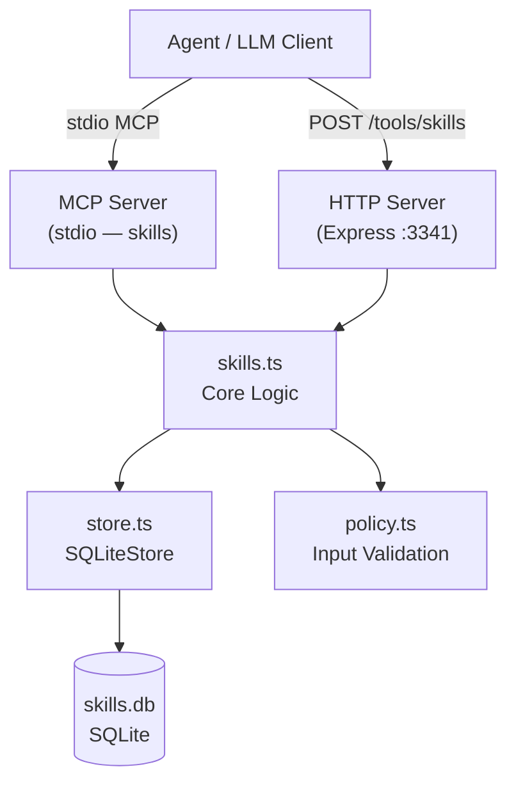
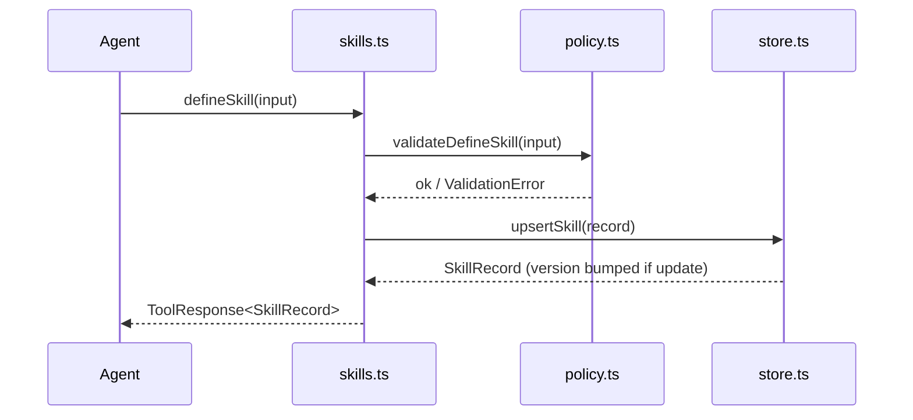
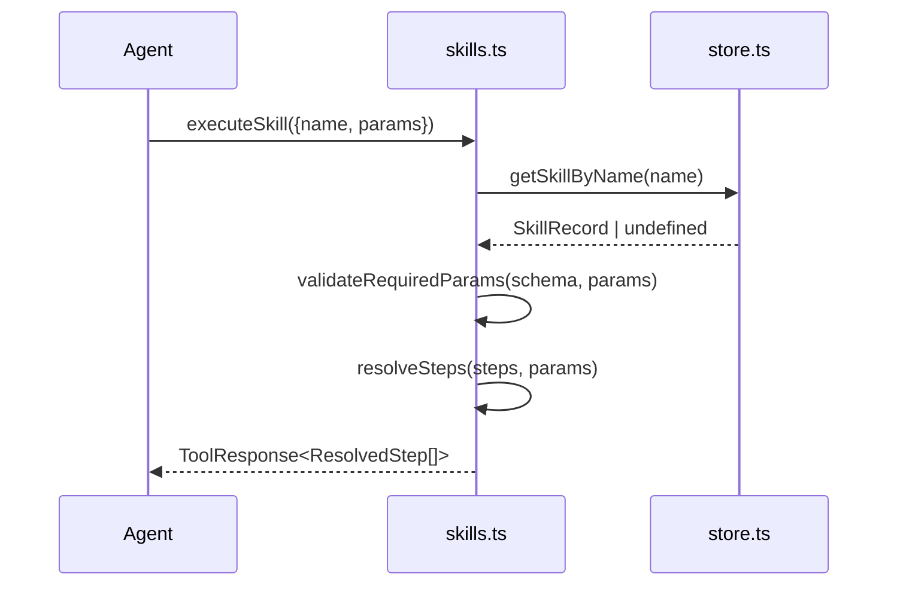

# Design Document: Skills Tool

## Overview

The Skills Tool is a persistent, reusable skill/playbook system exposed as an MCP tool (`skills`) and an HTTP Express server on port 3341. An agent defines named skills — each a parameterized template with a description, a JSON Schema for parameters, and an ordered sequence of steps (prompt templates or tool call descriptors). Skills survive process restarts via SQLite (`better-sqlite3`). The agent executes a skill by name, passing parameters, and receives the fully resolved step sequence ready for execution — the tool never calls other tools itself.

The workspace follows the established monorepo pattern (`Skills/`) with the same file layout as `RAG/` and `AskUser/`, using a flat Zod input shape on the MCP server to avoid SDK discriminated-union issues.

## Architecture



## Sequence Diagrams

### define_skill (create or update)



### execute_skill (resolve steps)



## Components and Interfaces

### skills.ts — Core Logic

**Purpose**: Orchestrates all skill operations; owns parameter validation and template resolution.

**Interface**:
```typescript
function defineSkill(input: DefineSkillInput): Promise<ToolResponse<SkillRecord>>
function executeSkill(input: ExecuteSkillInput): Promise<ToolResponse<ExecuteSkillResult>>
function getSkill(input: GetSkillInput): Promise<ToolResponse<SkillRecord>>
function listSkills(input: ListSkillsInput): Promise<ToolResponse<SkillListResult>>
function deleteSkill(input: DeleteSkillInput): Promise<ToolResponse<DeleteSkillResult>>
```

**Responsibilities**:
- Delegate input validation to `policy.ts`
- Resolve `{{paramName}}` placeholders in step templates
- Validate required params against the skill's JSON Schema before resolution
- Return `ToolResponse<T>` envelopes (from `@shared/types`)

### store.ts — SQLite Persistence

**Purpose**: All database reads/writes; owns schema init and migrations.

**Interface**:
```typescript
class SkillsStore {
  constructor(dbPath: string)
  upsertSkill(input: SkillUpsertInput): SkillRecord
  getSkillById(id: string): SkillRecord | undefined
  getSkillByName(name: string): SkillRecord | undefined
  listSkills(limit: number, offset: number): SkillSummary[]
  deleteSkill(identifier: string): { deleted: boolean }
  close(): void
}
```

**Responsibilities**:
- Initialize schema on construction (WAL mode, foreign keys on)
- Upsert by name: insert on first call, update + bump version on subsequent calls
- Serialize `paramSchema` and `steps` as JSON columns

### mcp-server.ts — MCP Registration

**Purpose**: Registers the `skills` MCP tool with a flat Zod input shape; routes to core logic.

**Interface**: Single exported `createSkillsMcpServer(): McpServer`

**Responsibilities**:
- Flat Zod shape — all fields optional except `action`
- Map action → payload fields → core function call
- Return `CallToolResult` with `isError` flag

### policy.ts — Input Validation

**Purpose**: Pure validation functions; no I/O.

**Interface**:
```typescript
function validateDefineSkill(input: unknown): DefineSkillInput
function validateExecuteSkill(input: unknown): ExecuteSkillInput
function validateGetSkill(input: unknown): GetSkillInput
function validateListSkills(input: unknown): ListSkillsInput
function validateDeleteSkill(input: unknown): DeleteSkillInput
```

### index.ts — HTTP Express Server

**Purpose**: Express server on port 3341; mirrors MCP operations over HTTP.

**Routes**:
- `GET /health`
- `GET /tool-schema`
- `POST /tools/skills`

## Data Models

### SkillRecord (DB row + API response)

```typescript
interface SkillRecord {
  id: string            // UUID v4
  name: string          // kebab-case slug, unique
  description: string
  param_schema_json: string   // serialized ParamSchema
  steps_json: string          // serialized Step[]
  version: number             // starts at 1, increments on update
  created_at: string          // ISO 8601
  updated_at: string          // ISO 8601
}
```

### ParamSchema

```typescript
interface ParamSchema {
  type: 'object'
  properties: Record<string, { type: string; description?: string }>
  required?: string[]
}
```

### Step (discriminated union)

```typescript
type Step =
  | { type: 'prompt'; template: string }
  | { type: 'tool_call'; tool: string; args: Record<string, string> }
```

**Validation Rules**:
- `name`: non-empty string, kebab-case (`/^[a-z0-9]+(-[a-z0-9]+)*$/`)
- `description`: non-empty string, max 1000 chars
- `steps`: non-empty array, max 100 steps
- `template` (prompt step): non-empty string
- `tool` (tool_call step): non-empty string
- `args` values: strings (may contain `{{param}}` placeholders)
- Param names in `{{...}}` must be valid identifiers (`/^\w+$/`)

### ResolvedStep

```typescript
type ResolvedStep =
  | { type: 'prompt'; text: string }
  | { type: 'tool_call'; tool: string; args: Record<string, string> }
```

### SkillSummary (list_skills item)

```typescript
interface SkillSummary {
  id: string
  name: string
  description: string
  stepCount: number
  version: number
  updatedAt: string
}
```

## SQLite Schema

```sql
CREATE TABLE IF NOT EXISTS skills (
  id               TEXT PRIMARY KEY,
  name             TEXT NOT NULL UNIQUE,
  description      TEXT NOT NULL,
  param_schema_json TEXT NOT NULL,
  steps_json       TEXT NOT NULL,
  version          INTEGER NOT NULL DEFAULT 1,
  created_at       DATETIME DEFAULT CURRENT_TIMESTAMP,
  updated_at       DATETIME DEFAULT CURRENT_TIMESTAMP
);

CREATE INDEX IF NOT EXISTS idx_skills_name ON skills(name);
```

## Key Functions with Formal Specifications

### resolveSteps(steps, params)

```typescript
function resolveSteps(steps: Step[], params: Record<string, unknown>): ResolvedStep[]
```

**Preconditions**:
- `steps` is a non-empty array of valid `Step` objects
- `params` contains all keys listed in the skill's `param_schema.required` array
- All param values are coercible to string

**Postconditions**:
- Returns array of same length as `steps`
- Every `{{paramName}}` occurrence in any template/arg value is replaced with `String(params[paramName])`
- Unknown `{{placeholders}}` (not in `params`) are left as-is (no error)
- Input `steps` array is not mutated

**Loop Invariant**: For each processed step `i`, `resolved[0..i]` contains fully substituted steps with no remaining `{{key}}` tokens for keys present in `params`.

### upsertSkill(input)

```typescript
upsertSkill(input: SkillUpsertInput): SkillRecord
```

**Preconditions**:
- `input.name` is a valid kebab-case slug
- `input.steps` is non-empty

**Postconditions**:
- If no skill with `input.name` existed: a new row is inserted with `version = 1`
- If a skill with `input.name` existed: the row is updated and `version` is incremented by 1
- `updated_at` is always set to current timestamp
- Returned `SkillRecord` reflects the persisted state

### validateRequiredParams(schema, params)

```typescript
function validateRequiredParams(schema: ParamSchema, params: Record<string, unknown>): void
```

**Preconditions**:
- `schema` is a valid `ParamSchema` object

**Postconditions**:
- Throws `ValidationError` with descriptive message if any key in `schema.required` is absent from `params`
- Returns `void` (no error) if all required params are present

## Algorithmic Pseudocode

### Main execute_skill Algorithm

```pascal
ALGORITHM executeSkill(input)
INPUT: input = { name: string, params: Record<string, unknown> }
OUTPUT: ToolResponse<ExecuteSkillResult>

BEGIN
  skill ← store.getSkillByName(input.name)

  IF skill IS NULL THEN
    RETURN errorResponse(NOT_FOUND, "Skill not found: " + input.name)
  END IF

  schema ← JSON.parse(skill.param_schema_json)
  steps  ← JSON.parse(skill.steps_json)

  FOR each requiredKey IN schema.required DO
    IF requiredKey NOT IN input.params THEN
      RETURN errorResponse(INVALID_INPUT, "Missing required param: " + requiredKey)
    END IF
  END FOR

  resolved ← []
  FOR each step IN steps DO
    IF step.type = 'prompt' THEN
      resolved.append({ type: 'prompt', text: interpolate(step.template, input.params) })
    ELSE IF step.type = 'tool_call' THEN
      resolvedArgs ← {}
      FOR each [key, val] IN step.args DO
        resolvedArgs[key] ← interpolate(val, input.params)
      END FOR
      resolved.append({ type: 'tool_call', tool: step.tool, args: resolvedArgs })
    END IF
  END FOR

  RETURN successResponse({ skillName: skill.name, resolvedSteps: resolved })
END
```

**Loop Invariant**: All steps in `resolved[0..i]` have had their `{{param}}` tokens replaced for all keys present in `input.params`.

### interpolate(template, params)

```pascal
ALGORITHM interpolate(template, params)
INPUT: template: string, params: Record<string, unknown>
OUTPUT: string

BEGIN
  result ← template
  FOR each [key, value] IN params DO
    placeholder ← "{{" + key + "}}"
    result ← result.replaceAll(placeholder, String(value))
  END FOR
  RETURN result
END
```

## MCP Tool: Flat Zod Input Shape

The `skills` MCP tool uses a single flat input shape (same pattern as `rag_knowledge`):

```typescript
const skillsInputShape = {
  action: z.enum([
    'define_skill', 'execute_skill', 'get_skill', 'list_skills', 'delete_skill'
  ]).describe("The operation to perform."),

  // define_skill fields
  name: z.string().optional().describe("(define_skill / get_skill / delete_skill / execute_skill) Kebab-case skill name."),
  description: z.string().optional().describe("(define_skill) Human-readable description."),
  paramSchema: z.object({
    type: z.literal('object'),
    properties: z.record(z.object({ type: z.string(), description: z.string().optional() })),
    required: z.array(z.string()).optional(),
  }).optional().describe("(define_skill) JSON Schema for skill parameters."),
  steps: z.array(z.object({
    type: z.enum(['prompt', 'tool_call']),
    template: z.string().optional(),
    tool: z.string().optional(),
    args: z.record(z.string()).optional(),
  })).optional().describe("(define_skill) Ordered step sequence."),

  // execute_skill fields
  params: z.record(z.unknown()).optional().describe("(execute_skill) Parameter values for interpolation."),

  // get_skill / delete_skill fields
  id: z.string().optional().describe("(get_skill / delete_skill) Skill UUID (alternative to name)."),

  // list_skills fields
  limit: z.number().optional().describe("(list_skills) Max results (default 20)."),
  offset: z.number().optional().describe("(list_skills) Pagination offset (default 0)."),
} as const
```

## Error Handling

### Skill Not Found

**Condition**: `get_skill`, `execute_skill`, or `delete_skill` called with unknown name/ID  
**Response**: `ToolResponse` with `errorCode: NOT_FOUND`, HTTP 404  
**Recovery**: Agent should call `list_skills` to discover available skill names

### Missing Required Parameter

**Condition**: `execute_skill` called without all params listed in `paramSchema.required`  
**Response**: `ToolResponse` with `errorCode: INVALID_INPUT`, message lists missing keys  
**Recovery**: Agent retries with complete params

### Invalid Skill Name

**Condition**: `define_skill` called with a name that fails kebab-case validation  
**Response**: `ToolResponse` with `errorCode: INVALID_INPUT`  
**Recovery**: Agent reformats name to kebab-case

### Invalid Step Shape

**Condition**: A step has `type: 'prompt'` but no `template`, or `type: 'tool_call'` but no `tool`  
**Response**: `ToolResponse` with `errorCode: INVALID_INPUT`, message identifies the step index  
**Recovery**: Agent corrects the step definition

### SQLite Error

**Condition**: Unexpected DB failure (disk full, corruption)  
**Response**: `ToolResponse` with `errorCode: EXECUTION_FAILED`  
**Recovery**: Logged to stderr; server remains running

## Testing Strategy

### Unit Testing Approach

Test files in `Skills/tests/`:
- `skills.test.ts` — core logic: define/execute/get/list/delete, version bumping, idempotent upsert
- `store.test.ts` — SQLite CRUD, upsert version increment, pagination
- `policy.test.ts` — validation: kebab-case enforcement, missing required fields, step shape rules
- `http.test.ts` — Express routes with supertest: all 5 actions, error status codes

Use an in-memory or temp-file SQLite DB for tests (`:memory:` path).

### Property-Based Testing Approach

**Property Test Library**: `fast-check`

Key properties:
- `interpolate(template, params)` — for any params object, all `{{key}}` tokens for keys present in params are replaced; result length ≥ 0; no mutation of input
- `resolveSteps` — output array length always equals input array length
- `upsertSkill` idempotency — calling upsert twice with same name always yields `version = 2`; calling N times yields `version = N`

### Integration Testing Approach

- MCP server integration: spin up `createSkillsMcpServer()`, send tool calls via in-process transport, assert `CallToolResult` shape
- Round-trip test: define a skill → execute it with params → assert all placeholders resolved

## Performance Considerations

- SQLite with WAL mode handles concurrent reads well; writes are serialized (acceptable for agent workloads)
- `steps_json` and `param_schema_json` are stored as TEXT; deserialization is O(n) in step count — negligible for expected skill sizes (< 100 steps)
- `list_skills` uses `LIMIT/OFFSET` pagination; no full-table scans for normal usage
- No caching layer needed at v2.1.0 scale

## Security Considerations

- No approval gating: skill definitions and executions are low-risk (no external I/O performed by this tool)
- `execute_skill` resolves templates but never invokes other tools — the agent is responsible for executing resolved steps
- Param values are interpolated as plain strings; no eval or shell execution occurs
- SQLite file path is configured via environment variable; default to `./skills.db`
- Input validation (kebab-case names, max step count, max description length) prevents trivially malformed data from reaching the DB

## Dependencies

Follows the same dependency set as `RAG/`:

```json
{
  "dependencies": {
    "@modelcontextprotocol/sdk": "^1.26.0",
    "@shared/types": "file:../shared",
    "better-sqlite3": "^12.6.2",
    "cors": "^2.8.5",
    "dotenv": "^16.6.1",
    "express": "^4.21.2",
    "uuid": "^9.0.1",
    "zod": "^3.25.76"
  },
  "devDependencies": {
    "@types/better-sqlite3": "^7.6.8",
    "@types/cors": "^2.8.19",
    "@types/express": "^4.17.23",
    "@types/node": "^22.13.1",
    "@types/uuid": "^9.0.7",
    "fast-check": "^3.x",
    "tsx": "^4.19.3",
    "typescript": "^5.8.2"
  }
}
```


## Correctness Properties

*A property is a characteristic or behavior that should hold true across all valid executions of a system — essentially, a formal statement about what the system should do. Properties serve as the bridge between human-readable specifications and machine-verifiable correctness guarantees.*

### Property 1: Persistence round-trip

*For any* valid skill definition, writing it to the store and then reading it back by name should return a record whose `name`, `description`, `paramSchema`, and `steps` fields are equivalent to the original input.

**Validates: Requirements 7.3, 7.4**

---

### Property 2: Upsert version increment

*For any* valid skill definition, calling `define_skill` N times with the same name should yield a `SkillRecord` with `version = N`.

**Validates: Requirements 2.1, 2.2**

---

### Property 3: Kebab-case rejection

*For any* string that does not match `/^[a-z0-9]+(-[a-z0-9]+)*$/`, calling `define_skill` with that string as `name` should return `errorCode: INVALID_INPUT`.

**Validates: Requirements 2.4, 8.1**

---

### Property 4: Description length rejection

*For any* description string whose length exceeds 1000 characters, calling `define_skill` should return `errorCode: INVALID_INPUT`.

**Validates: Requirements 2.6, 8.1**

---

### Property 5: Step resolution length invariant

*For any* skill with N steps and any params map that satisfies the skill's required params, calling `execute_skill` should return a `ResolvedStep` array of exactly length N.

**Validates: Requirements 3.1**

---

### Property 6: Interpolation replaces known tokens

*For any* step (prompt or tool_call) and any params map, every `{{key}}` token whose key is present in `params` should be replaced with `String(params[key])` in the resolved output, and no `{{key}}` token for a key present in `params` should remain.

**Validates: Requirements 3.2, 3.3**

---

### Property 7: Unknown placeholders are preserved

*For any* template string containing `{{unknownKey}}` where `unknownKey` is absent from `params`, the resolved output should contain the literal string `{{unknownKey}}` unchanged.

**Validates: Requirements 3.4**

---

### Property 8: Missing required params rejected

*For any* skill whose `paramSchema.required` is non-empty, calling `execute_skill` without all required keys should return `errorCode: INVALID_INPUT`.

**Validates: Requirements 3.7**

---

### Property 9: Get skill round-trip

*For any* skill that has been defined, calling `get_skill` with either its `name` or its `id` should return a `SkillRecord` whose fields match the most recently upserted definition.

**Validates: Requirements 4.1, 4.2**

---

### Property 10: List skills pagination bound

*For any* set of stored skills and any `limit` value L, calling `list_skills` with `limit = L` should return an array of length at most L, and each element should include `id`, `name`, `description`, `stepCount`, `version`, and `updatedAt`.

**Validates: Requirements 5.1, 5.2, 5.6**

---

### Property 11: Delete removes skill

*For any* skill that exists in the store, calling `delete_skill` by name or id should result in a subsequent `get_skill` call returning `errorCode: NOT_FOUND`.

**Validates: Requirements 6.1, 6.2**

---

### Property 12: HTTP error code mapping

*For any* request that produces `NOT_FOUND`, the HTTP response status should be 404; *for any* request that produces `INVALID_INPUT`, the HTTP response status should be 400; *for any* request that produces `EXECUTION_FAILED`, the HTTP response status should be 500.

**Validates: Requirements 9.6, 9.7, 9.8**
